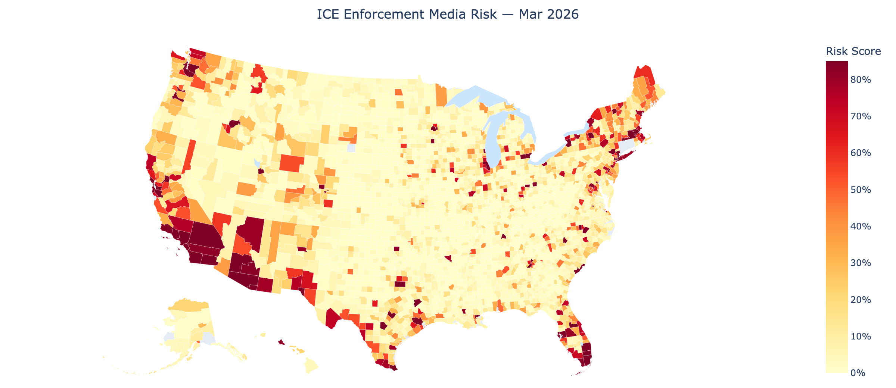

# ICE Enforcement Media Risk Model


A statistical pipeline that estimates the probability of a US county appearing in **immigration enforcement media coverage** in the following month. Outputs an interactive animated choropleth map across all 3,222 US counties.

> **⚠️ Media attention model, not an enforcement intensity model.**
> The dependent variable is derived from news coverage (GDELT), not from official enforcement records.
> Coverage is systematically lower in Republican-leaning and rural areas due to media geography —
> not because enforcement is less frequent there. See [Known Limitations](#known-limitations).

---

## Interactive Map + County Risk Lookup

**[→ Open interactive dashboard](https://WeihaoGe1009.github.io/ice-risk-modeling/)**

[](https://WeihaoGe1009.github.io/ice-risk-modeling/)

The dashboard page (link above) contains two sections:

1. **Animated choropleth map** — all 3,222 US counties color-coded by risk score, with a month slider (Jan 2025 – Mar 2026) and hover details
2. **County risk lookup** (scroll down on the page) — select State → County → Month to get a predicted probability with 95% interval and Low / Medium / High risk classification for up to 6 months ahead

> GitHub README cannot run JavaScript, so the interactive content lives on the linked page, not here.

---

## Model Summary

| | |
|---|---|
| **Outcome** | Binary: county has ≥1 media mention of immigration enforcement next month |
| **Data source** | GDELT GKG v1, deduplicated by CAMEO event ID |
| **Model** | Mixed-effects logistic regression (`lme4::glmer`) |
| **Features** | Demographics · political · geographic · temporal momentum |
| **Offset** | State-level ICE arrest rate (Deportation Data Project FY23–26) |
| **Random effect** | County intercept (3,222 counties) |
| **Train period** | 2025-01 → 2025-09 |
| **Val period** | 2025-10 → 2026-03 |
| **AUC-PR** | **0.648** (baseline ≈ 0.15) |
| **F2 / Recall / Precision** | **0.661 / 79.5% / 39.5%** at threshold 0.157 |

### Key Findings

| Feature | Coefficient | Interpretation |
|---|---|---|
| Republican vote share 2024 | **−0.85 ★★★** | Strongest predictor — media geography, not enforcement |
| Urban (vs rural) | **+0.79 ★★★** | Urban areas generate far more coverage per operation |
| Border zone (100 mi) | **+0.70 ★★★** | ~2× higher baseline log-odds |
| Suburban (vs rural) | **+0.52 ★★★** | |
| % Poverty | **−0.42 ★★★** | Wealthier immigrant enclaves are more media-visible |
| % Foreign-born | **+0.13 ★★** | Established communities → more reported incidents |
| % Hispanic | **+0.11 ★★** | |
| Pop. density | **+0.20 ★★** | |
| Lag 1 month | **+0.23 ★★** | News momentum — prior coverage predicts next month |
| Lag 3 months | **+0.38 ★★** | |
| Crime rate, HH income | ≈ 0 | No meaningful signal |

★★★ p < 0.001 · ★★ p < 0.05 · open = not significant

### Calibration

The model is well-calibrated at the extremes (predicted 3.8% vs observed 3.9% in the lowest
decile; 95.6% vs 95.2% in the highest) but overestimates in the 0.2–0.8 range — a known
characteristic of logistic regression on imbalanced data. Predictions are reliable for
**screening** (flagging/not-flagging) but mid-range probabilities should not be read as precise.

---

## How It Works

### Dependent variable

GDELT GKG v1 daily files (Jan 2025 – Apr 2026) are filtered to articles mentioning
`IMMIGRATION` plus at least one enforcement-specific theme:

```
DISCRIMINATION_IMMIGRATION_ANTIIMMIGRANT
TAX_FNCACT_IMMIGRATION_OFFICER
TAX_FNCACT_BORDER_PATROL_AGENT
WB_2491_BORDER_SECURITY
UNREST_CLOSINGBORDER
```

Articles are deduplicated by **CAMEO event ID** — multiple outlets covering the same
ICE operation count as one event, not one per outlet. Locations are resolved to
county FIPS via Census TIGER name matching + point-in-polygon spatial join fallback.

### ICE enforcement offset

State-level monthly ICE arrest counts (from the Deportation Data Project FY23–26) are
converted to a rate per 100k population and entered as `offset(log1p(rate))`. This anchors
each county's predicted probability to the state's observed enforcement intensity with a
fixed coefficient of 1 — it shifts the baseline rather than letting the model estimate
a free coefficient that might absorb demographic signal.

### Model formula (R)

```r
glmer(
  outcome ~ pct_hispanic + pct_black + pct_asian + pct_foreign_born
          + median_hh_income + pct_poverty + pop_density
          + rep_vote_share_2024 + crime_rate_per_100k
          + lag_1m + lag_3m + lag_6m
          + in_border_zone + urban_rural
          + offset(log1p(ice_arrest_rate_state))
          + (1 | fips),
  family  = binomial(link = "logit"),
  data    = train_scaled     # features standardised on training set
)
```

> The model was specified with `cloglog` link (theoretically appropriate for rare binary
> events under a Poisson process) but fell back to `logit` — cloglog is numerically
> more sensitive near p ≈ 0, and the state-level offset pushed some predictions into
> the unstable region. At 15% prevalence the two links produce nearly identical results.

---

## Running Locally

### 1. Python environment

```bash
pip install -r requirements.txt
```

### 2. R packages

The training script auto-installs on first run:
```bash
Rscript model/train.R   # installs lme4, PRROC, dplyr, readr, tibble, jsonlite
```

### 3. Census API key (for `fetch_static.py` only)

```bash
export CENSUS_API_KEY=your_key_here   # free: https://api.census.gov/data/key_signup.html
```

### 4. Manual downloads (pipeline only — not needed to run the dashboard)

Two sources require a browser:

**A. MIT Election Lab — 2024 county presidential returns**
1. Go to <https://electionlab.mit.edu/data>
2. Download **County Presidential Returns 2000–2024**
3. Save as `data/raw/election/countypres_2000-2024.tab`

**B. FBI crime data**
1. Go to <https://cde.ucr.cjis.gov/LATEST/webapp/#/pages/downloads>
2. Download **Offenses Known to Law Enforcement** (most recent year)
3. Save as `data/raw/crime/fbi_county_crime_2024.csv`

If absent, `crime_rate_per_100k` is median-imputed. Safe to skip for development.

### 5. Run the full pipeline

```bash
# Fetch static county features (demographics, election, crime, border zone)
python data/fetch_static.py

# Fetch GDELT news data and aggregate to county × month
# (~480 days; resumable via checkpoint)
python data/fetch_gdelt.py

# Build model panel
python data/build_panel.py

# Train model (saves artifacts to model/model_artifacts/)
Rscript model/train.R

# Regenerate the interactive map (writes docs/index.html + docs/preview.png)
python scripts/generate_map.py
```

### 6. View the map without re-running the pipeline

Pre-computed artifacts are already in the repo. Just regenerate the HTML:

```bash
pip install plotly pandas kaleido
python scripts/generate_map.py
# Then open docs/index.html in your browser
```

---

## Project Structure

```
data/
  fetch_static.py          # ACS, USDA RUCC, election, FBI crime, border zone
  fetch_gdelt.py           # GDELT GKG v1 → county × month binary indicators
  build_panel.py           # Full panel + lag features + ICE arrest rate
  processed/
    static_features.csv    # 3,222 counties × 14 static features (in repo)
model/
  train.R                  # glmer fit + threshold selection + artifact export
  model_artifacts/
    fixed_effects.csv      # Coefficients, SE, p-values, 95% CI
    random_effects.csv     # County BLUPs (3,222 intercepts)
    predictions_all.csv    # Full panel predictions
    threshold.json         # Operating threshold + validation metrics
    calibration_data.csv   # Calibration bins for plot
    scale_params.csv       # Feature means/SDs (apply to new data)
scripts/
  generate_map.py          # Builds docs/index.html (GitHub Pages map)
docs/
  index.html               # Interactive animated choropleth (GitHub Pages)
  preview.png              # Static map snapshot (README embed)
requirements.txt
```

---

## Known Limitations

- **Not a law-enforcement dataset.** GDELT captures media coverage, not ground-truth operations.
- **Republican-area blind spot.** The model underestimates risk in deeply conservative,
  rural areas where national media coverage is sparse. The negative Republican vote share
  coefficient reflects *media geography*, not enforcement pattern.
- **Low-confidence counties** (< 3 positive months in training data) have unreliable
  predictions. Flagged as `low_confidence` and toggleable on the dashboard map.
- **Static features are 2023 vintage.** Post-2023 demographic shifts are not captured.
- **State ICE offset covers FY23–26.** Months outside this window default to zero offset
  (offset term drops out of the linear predictor).
- **Calibration overestimates in the 0.2–0.8 range.** Use predictions for rank-ordering,
  not as precise probabilities.

---

## Data Sources

| Source | What | Vintage |
|---|---|---|
| [GDELT GKG v1](https://blog.gdeltproject.org/gdelt-2-0-our-global-world-in-realtime/) | Dependent variable | Jan 2025 – Apr 2026 |
| [Deportation Data Project](https://deportationdata.org) | ICE arrest rate (offset) | FY2023–2026 |
| [Census ACS DP05/DP02/DP03](https://www.census.gov/programs-surveys/acs/) | Demographics | 2023 5-yr |
| [USDA RUCC](https://www.ers.usda.gov/data-products/rural-urban-continuum-codes/) | Urban/rural classification | 2023 |
| [MIT Election Lab](https://electionlab.mit.edu/data) | 2024 presidential returns | 2024 |
| [FBI UCR/NIBRS](https://cde.ucr.cjis.gov/) | Crime rate per 100k | 2022 |
| [Census TIGER](https://www.census.gov/geographies/mapping-files/time-series/geo/tiger-line-file.html) | County shapefiles | 2023 |

---

## License

MIT
